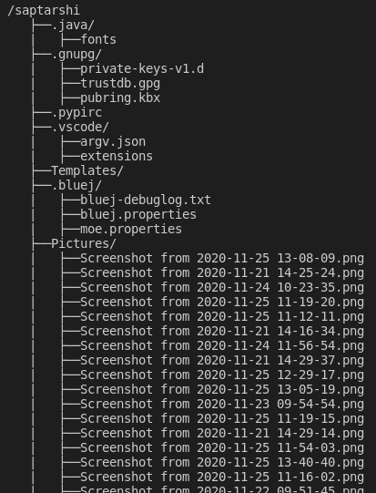

# pylss

Python implementation of `ls` command

### **`ls is a command to list computer files in Unix and Unix-like operating systems.`**

## Usage

### **`pip install pylss`**

- importing as a function
  ```py
  from pylss import getDirList
  ```
- ```py
  getDirList()
  ```

### O/P


